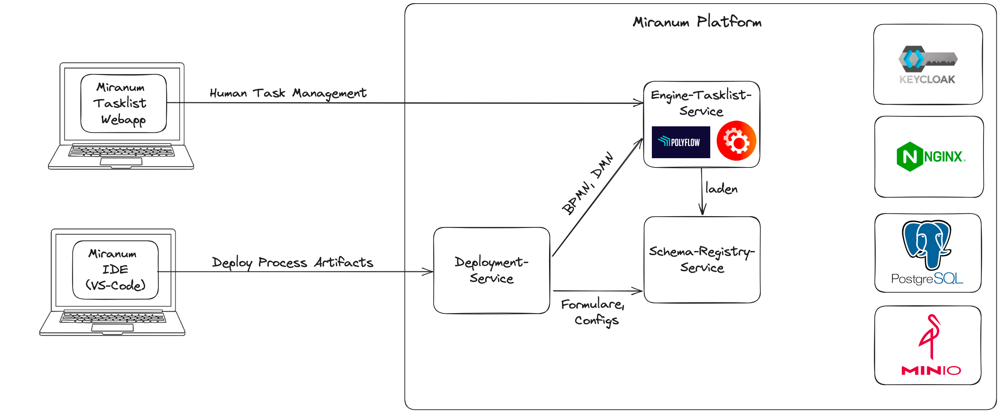

<!-- PROJECT SHIELDS -->
[![Contributors][contributors-shield]][contributors-url]
[![Forks][forks-shield]][forks-url]
[![Stargazers][stars-shield]][stars-url]
[![Issues][issues-shield]][issues-url]
[![MIT License][license-shield]][license-url]
[![C7][c7-shield]][c7-url]
<!-- END OF PROJECT SHIELDS --> 

<!-- PROJECT LOGO -->
 

    
    <h3><a href="https://miranum.com/">Miranum Platform</a></h3>
    

        <i>Simplifying the complexity of process automation.</i>
         
        <a href="https://github.com/Miragon/miranum-platform/issues">Report Bug</a>
        ·
        <a href="https://github.com/Miragon/miranum-platform/pulls">Request Feature</a>
    

## About The Project

Miranum Platform is an open source production ready process automation platform with a focus on human-task driven
processes.
Many components of this repository are based on the [DigiWF project](https://github.com/it-at-m/digiwf-core).

Content of this readme:

* [Use-Cases](#use-cases)
* [Platform Overview](#platform-overview)
* [Get Started](#get-started)
* [Contribution](#contributing)
* [Code of Conduct](#code-of-conduct)
* [License](#license)

## Use-Cases

Miranum Platform is a solution for complex human task management workflows.
With its unified Tasklist and JSON-based forms it represents a generic approach to task management,
suitable for automating many different processes.
Besides it provides all necessary components for task management purposes such as the Minio S3 storage
as well as Keycloak.

Even though Miranum Platform was created out of a project in the public sector it can be used versatile in many
different
industries. Whenever you deal with human task management and need a centralized Tasklist, Miranum Platform is a possible
choice.

## Platform Overview

Miranum Platform uses Camunda 7 as process engine with Polyflow for task handling.
In addition, system components such as Keycloak, Nginx, PostgreSQL and Minio are being used.
The latter tools are interchangeable but work best in the current version.

Components:

* Engine Tasklist Service:
  Includes [Camunda Platform 7](https://github.com/camunda/camunda-bpm-platform), [Polyflow](https://github.com/holunda-io/camunda-bpm-taskpool)
  and the Miranum Tasklist Backend.
* Miranum Tasklist Webapp: Single-page application build with vue.js which renders the forms and tasklist.
* Miranum IDE: Collection
  of [vs-code plugins](https://marketplace.visualstudio.com/items?itemName=miragon-gmbh.miranum-ide) to model bpmn
  processes, dmn decisions and forms
  using [vuetify-jsonschema-forms](https://github.com/koumoul-dev/vuetify-jsonschema-form).
* Schema Registry Service:
* Deployment Service:
* Keycloak:Open Source Identity and Access Management tool
* Nginx: Ingress controller
* PostgreSQL: Relational database
* Minio: MinIO is a High Performance Object Storage which is API compatible with Amazon S3 cloud storage service.

## Get Started

To get started with Miranum Platform please navigate to the [platform-stack](platform/platform-stack) folder and follow
the
instructions in the [README.md](platform/platform-stack/README.md). Once the infrastructure components have started you
can run the
`local` run configuration. Make sure that you have performed a `mvn clean build` before doing so.

A more in
depth [miranum-stack-showcase](https://miranum.com/docs/guides/showcases/miranum-stack/miranum-stack-showcase/)
can be found in our documentation.

## Contributing

Contributions are what make the open source community such an amazing place to learn, inspire, and create. Any
contributions you make are **greatly appreciated**.
To collect, prioritise and work on issues in a collaborative fashion we have established
some [contribution guidelines](https://miranum.com/docs/components/contributing) as well as
a [GitHub project](https://github.com/orgs/Miragon/projects/9).
Please make sure to read through these guidelines before starting with your contribution.

### PRs for every change

All changes have to be done in a separate Branch or Fork (if you are an external contributor). As soon as the changes
are
done please open a PR. A GitHub Action runs with every commit to a Branch and checks if the documentation can be built.
If you create a new branch make sure to name it according to what it does (e.g. feat/xyz or fix/xyz). Please use
semantic
commit messages as described in [here](https://gist.github.com/joshbuchea/6f47e86d2510bce28f8e7f42ae84c716).

### Code reviews

We are using simple emoji's to help convey intention and added meaning in code review comments. A little bit of emoji
can
go a long way when it comes to code reviews and make giving and receiving code review a little bit more enjoyable.
We are following this [guide by erikthedeveloper](https://github.com/erikthedeveloper/code-review-emoji-guide).

## Code of Conduct

This project adheres to the [Contributor Covenant Code of Conduct](./CODE_OF_CONDUCT.md). By participating, you are
expected to uphold this code.
Please report unacceptable behavior to info@miragon.io.

## License

Distributed under the MIT License. See `LICENSE` file for more information.

(<a href="#top">back to top</a>)

<!-- MARKDOWN LINKS & IMAGES -->
<!-- https://www.markdownguide.org/basic-syntax/#reference-style-links -->

[contributors-shield]: https://img.shields.io/github/contributors/Miragon/miranum-platform.svg?style=for-the-badge

[contributors-url]: https://github.com/Miragon/miranum-platform/graphs/contributors

[forks-shield]: https://img.shields.io/github/forks/Miragon/miranum-platform.svg?style=for-the-badge

[forks-url]: https://github.com/Miragon/miranum-platform/network/members

[stars-shield]: https://img.shields.io/github/stars/Miragon/miranum-platform.svg?style=for-the-badge

[stars-url]: https://github.com/Miragon/miranum-platform/stargazers

[issues-shield]: https://img.shields.io/github/issues/Miragon/miranum-platform.svg?style=for-the-badge

[issues-url]: https://github.com/Miragon/miranum-platform/issues

[license-shield]: https://img.shields.io/github/license/Miragon/miranum-platform.svg?style=for-the-badge

[license-url]: https://github.com/Miragon/miranum-platform/blob/main/LICENSE

[c7-shield]: https://img.shields.io/badge/Compatible%20with-Camunda%20Platform%207-blue.svg?style=for-the-badge

[c7-url]: https://camunda.com/de/platform-7/