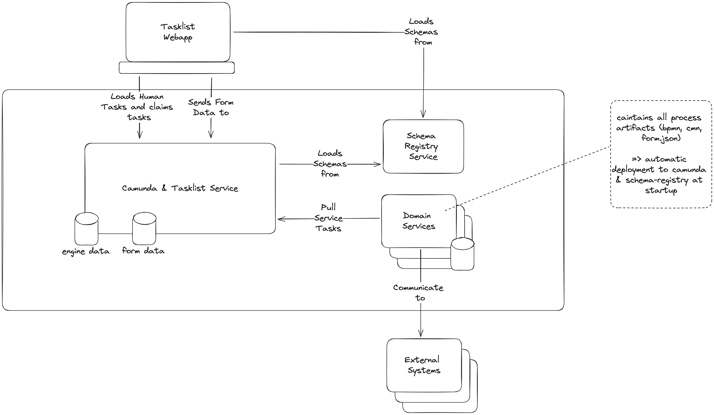

# Where to store form data

* Status: proposed
* Deciders: Andreas Riepl, Dominik Horn, Thomas Heinrichs
* Date: 2023-09-13

## Context and Problem Statement

In our current implementation, we save the form data in the engine database.
This is not a good solution, because the engine database will be very large and slow down the camunda-tasklist-serivce.
Additionally, it's hard to access the data for other services.

## Decision Drivers <!-- optional -->

* Extendability (should be effortless to implement new processes)
* Clean separation of concerns (data is easily accessible for all services)
* Lifecycling: Update libraries should be convenient (the more components, the harder it is)

## Considered Options

### 1. Save in Datapool

Since we already use polyflow as tasklist service, we can use its data-aggregation listeners to store all form data in a separate (no-)sql database. 
The engine database would only contain an id and we would have and one database with all domain objects.

* Good, because it is a generic solution with one frontend
* Good, because we would not store domain data in the domain services, but in the datapool
* Good, because less lifecycle management
* Good, because processes without integrations might not need a domain service
* Bad, because it might not be the best fit for more complex ecoystems.
* Bad, because it only allows data-access directly at the database (generic endpoint in service might be considerable)

### 2. Save in Domain-Services

According to Domain Driven Design, the domain services are responsible for the data. Everything regarding the data should be handled by the domain services.
This would mean that the form data is saved in the domain services.
Therefore we need to implement a frontend for each domain service. Those might be embeddable as web-components.
That holds a render-component for each form and stores the data directly to the domains rest api.

* Good, because it stores the data in a structured way in the domain services
* Good, if you have strong developer teams
* Good, because most less data in process
* Bad, because of lifecycle management
* Bad or Good, because data changes have to be modeled (the process can not change data)

### 3. Save in Schema-Registry

Since the generic tasklist frontend already knows where to load the json form it could also store the data there.

* Good, because it is a generic solution with one frontend
* Good, because you access the data directly with its schema: `/schema-registry/{boundle-id}/{version}/{form-key}/{data-id}`
* Bad, because the engine has no direct access to the data if there is a gateway

Only a good feature to store the users submission.  
In that case an engines gateway has no access to the data.

## Decision Outcome

It depends. 
