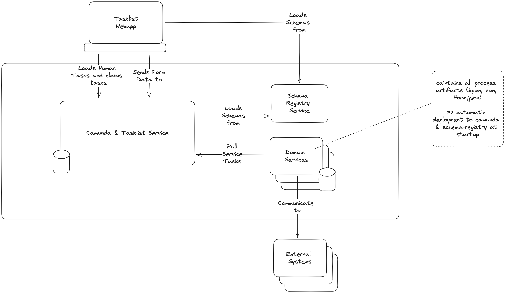
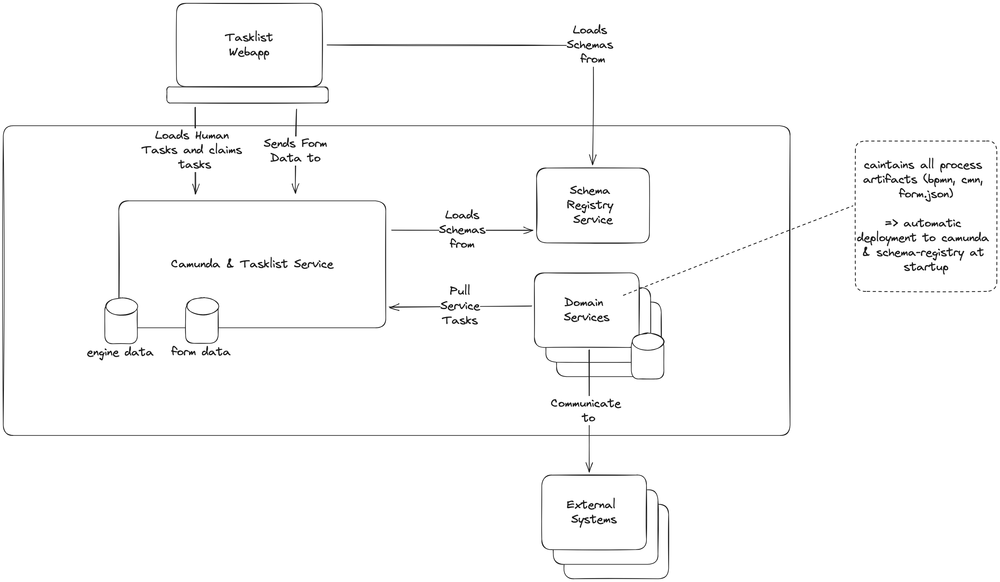
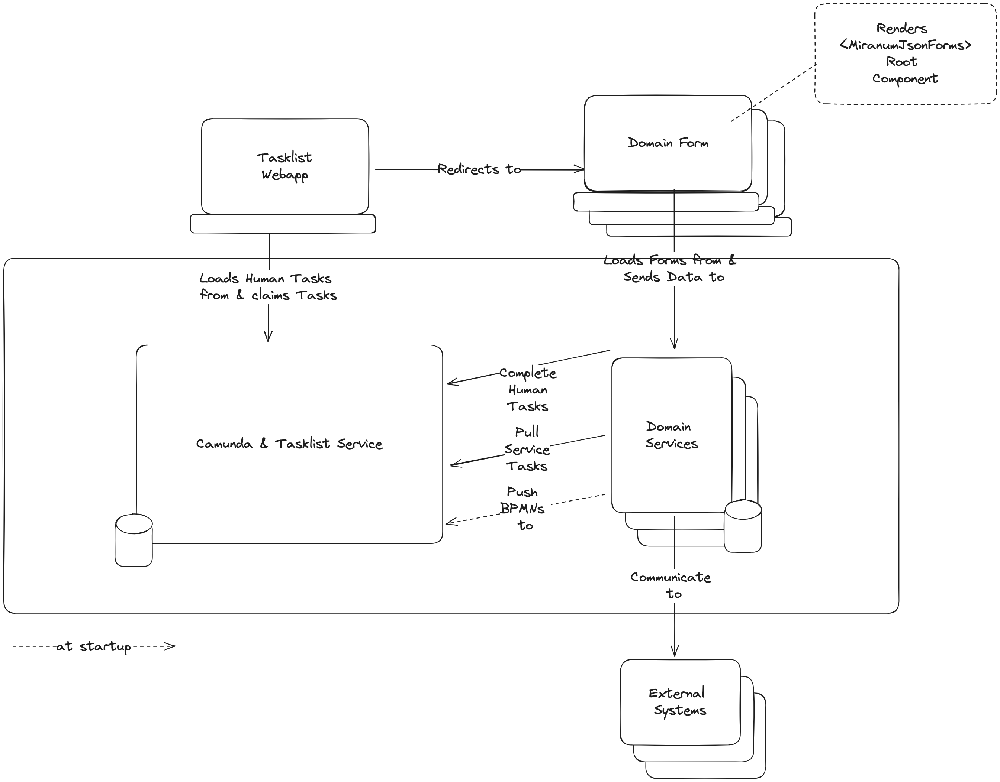
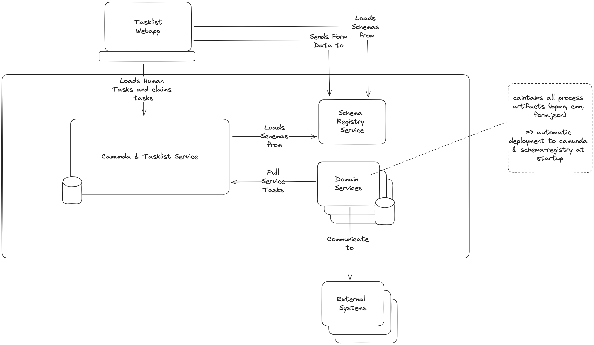

# Where to store form data

* Status: proposed
* Deciders: Andreas Riepl, Dominik Horn, Thomas Heinrichs
* Date: 2023-09-13

## Context and Problem Statement

In our current implementation, we save the form data in the engine database.
This is not a good solution, because the engine database will be very large and slow down the engine.

## Decision Drivers <!-- optional -->

* Extendability (should be effortless to implement new processes)
* Clean separation of concerns (data is easily accessible for all services)

## Considered Options

### 1. Save in Datapool

Since we already use polyflow as tasklist service, we can use its data-aggregation listeners to store all form data in a separate no-sql database.

### 2. Save in Domain-Services

According to Domain Driven Design, the domain services are responsible for the data. Everything regarding the data should be handled by the domain services.
This would mean that the form data is saved in the domain services.
Therefore we need to implement a frontend for each domain service.
That holds a render-component for each form and stores the data directly to the domains rest api.

### 3. Save in Schema-Registry

Since the generic tasklist frontend already knows where to load the json form it could also store the data there.

## Decision Outcome

Chosen option: "[option 1]", because [justification. e.g., only option, which meets k.o. criterion decision driver | which resolves force force | … | comes out best (see below)].

### Positive Consequences <!-- optional -->

* [e.g., improvement of quality attribute satisfaction, follow-up decisions required, …]
* …

### Negative Consequences <!-- optional -->

* [e.g., compromising quality attribute, follow-up decisions required, …]
* …

## Pros and Cons of the Options <!-- optional -->

### [option 1]

[example | description | pointer to more information | …] <!-- optional -->

* Good, because [argument a]
* Good, because [argument b]
* Bad, because [argument c]
* … <!-- numbers of pros and cons can vary -->

### [option 2]

[example | description | pointer to more information | …] <!-- optional -->

* Good, because [argument a]
* Good, because [argument b]
* Bad, because [argument c]
* … <!-- numbers of pros and cons can vary -->

### [option 3]

[example | description | pointer to more information | …] <!-- optional -->

* Good, because [argument a]
* Good, because [argument b]
* Bad, because [argument c]
* … <!-- numbers of pros and cons can vary -->

## Links <!-- optional -->

* [Link type] [Link to ADR] <!-- example: Refined by [ADR-0005](0005-example.md) -->
* … <!-- numbers of links can vary -->
